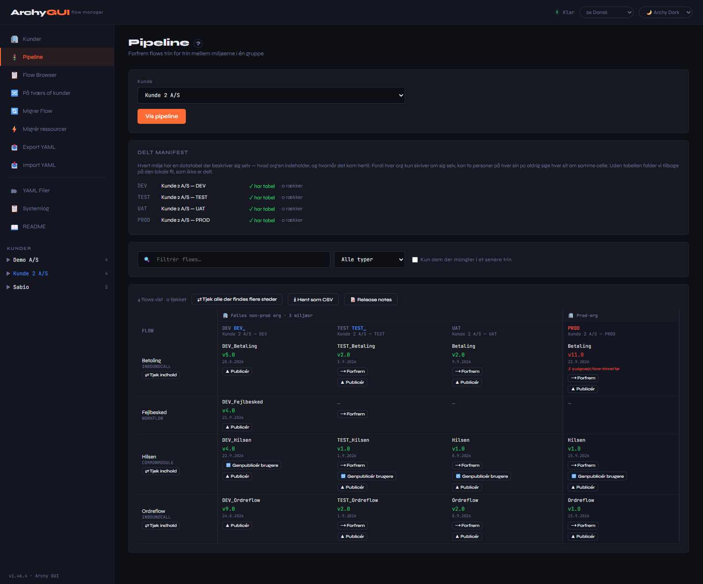
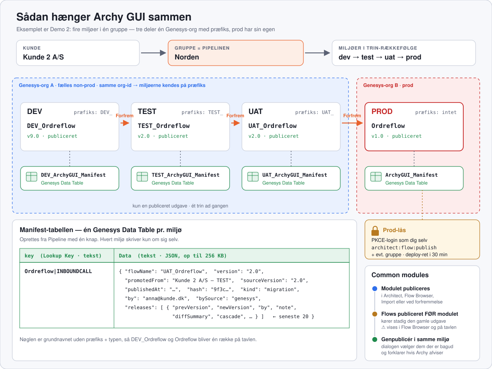
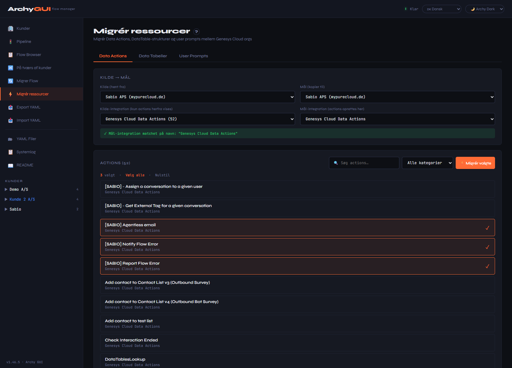
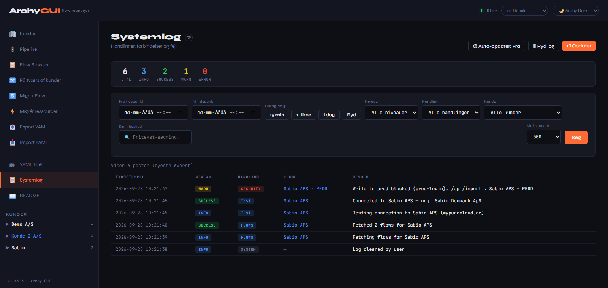
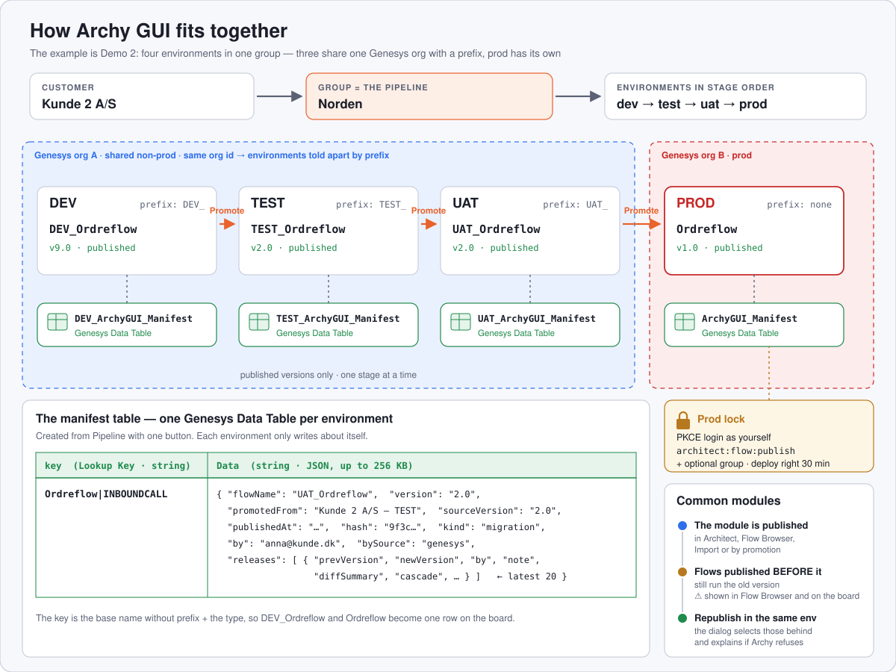

# Archy GUI — Flow Manager · v1.47.2

> 🇩🇰 [Dansk](#dansk) · 🇬🇧 [English](#english)



*Pipeline med Demo 2 — det man ser når programmet åbnes. Miljøerne står som kolonner i trin-rækkefølge, flowene som rækker.*
*Pipeline with Demo 2 — what you see when the app opens. The environments are columns in stage order, the flows are rows.*

---

## Changelog

Alle ændringer står i **[CHANGELOG.md](CHANGELOG.md)** — nuværende version er **v1.47.2**.
All changes live in **[CHANGELOG.md](CHANGELOG.md)** — the current version is **v1.47.2**.

---

<a name="dansk"></a>
## 🇩🇰 Dansk

Et grafisk interface til [Archy](https://help.mypurecloud.com/articles/archy/) med multi-kunde support, flow-migration, Data Action migration og OAuth PKCE login.

### Krav
- **Node.js 18+**
- **Archy** installeret og tilgængeligt i PATH (`archy version` skal returnere en version)
- En Genesys Cloud OAuth-klient af typen **Code Authorization** (PKCE) pr. org, med redirect URI `http://localhost:3737/auth/callback`. Ældre miljøer med Client Credentials virker stadig, men nye oprettes altid med PKCE

### Installation

```bash
cd C:\Tools\Archy-gui
npm install
```

### Start

Dobbeltklik på **`start.bat`** — den:
1. Stopper eventuel tidligere instans på port 3737
2. Starter serveren **skjult i baggrunden** — output i `server.log`, fejl i `server.err.log`
3. Venter til serveren er klar (højst 30 sekunder — ellers vises de sidste linjer af `server.err.log`)
4. Åbner automatisk **http://localhost:3737** i browseren og lukker sit eget vindue

Serveren kører videre, når vinduet er lukket. **`stop.bat`** stopper den. Kører man `start.bat` igen, genstartes serveren — fx efter en opdatering.

Alternativt manuelt: `node server.js`

Er der sat grupper op, **åbner programmet på Pipeline** med den kunde du sidst arbejdede med — som på billedet øverst. Tavlen hentes når du trykker *Vis pipeline*.

---

### Sådan hænger det sammen



En **kunde** har én eller flere **grupper**, og hver gruppe er en **pipeline** af miljøer: dev → test → uat → prod. Et miljø er én Genesys-org set gennem én OAuth-klient. Deler flere miljøer samme org, kendes de på et **præfiks** i flownavnet. Flows **forfremmes** ét trin ad gangen, og hvert miljø holder sin egen historik i en **manifest-tabel** — en Genesys Data Table i org'en. Prod er låst bag et personligt login, og ændres et **common module**, genpubliceres de flows der bruger det, i samme miljø.

### Funktioner

#### 🏢 Kunder
Nye miljøer oprettes altid med **🌐 OAuth (PKCE)**: du logger ind i Genesys som dig selv, kun Client ID gemmes, og tokenet lever kun i serverens hukommelse. Ældre miljøer med **🔑 Client Credentials** (Client ID + secret i `customers.json`) virker stadig og er markeret med **gult**.

**⚙ Indstillinger** på hvert kort rummer navn, kunde, gruppe, trin, præfiks, org-navn, farve, division, godkendelse og krav til prod. Felterne tjekkes når de gemmes (se Sikkerhed), og omdøbes et miljø, flytter dets eksportmappe med.

**Hjælp ved hvert felt.** Alle felter — både når man opretter et miljø og under ⚙ Indstillinger — har en etiket og et **ⓘ**. Hold musen over ⓘ for at se hvad feltet bruges til, eller klik for at folde forklaringen ud under etiketten.

**Godkendelse og Client ID.** *Godkendelse* viser miljøets nuværende valg — nye miljøer får altid OAuth (PKCE), og står et ældre miljø på client credentials, siger en note at PKCE anbefales. Client ID står udfyldt, og under feltet vises **navnet på OAuth-klienten i Genesys** og dens type, så man kan finde den igen blandt kundens klienter (kræver login og `oauth:client:view`). Feltet til secret vises kun ved client credentials, og deploy-kravene kun på prod.

**🔌 Test** kontrollerer forbindelsen og **rettighederne**. Programmet slår miljøets faktiske rettigheder op — for en person (PKCE) direkte, for client credentials via klientens roller — og holder dem op mod hver funktion: læse, importere og publicere flows, Archy, datatabeller og manifest, Data Actions, prompts, divisioner, køer, brugere og afhængigheder. Kortet viser en liste med ✓ og ✗ og de rettigheder der mangler. Kan klientens roller ikke læses (kræver `oauth:client:view` og `authorization:role:view`), prøves læseadgangen af i stedet, og det der ikke kan prøves uden at skrive, står som *kunne ikke afgøres*. Fejler forbindelsen, står fejlen på kortet.

**Log ind hvor du står.** Mangler et miljø login, kommer der en bjælke øverst med en **Log ind**-knap — på alle sider, ikke kun Kunder — og siden hentes igen bagefter. 🔒 ved miljøet i sidebjælken logger også ind; 🟢 når man er logget ind. Hold musen over 🟢 — eller se login-mærket på kortet — for at se hvilken org man er logget ind i.

**Mange kunder.** Søgefeltet over kortene finder på navn, kunde, gruppe, trin og org-navn, og *Kun dem der kræver login* viser dem man mangler. Kortene sorteres efter kunde og trin, og formularen og demo-kunderne er foldet sammen.

**Kunde → gruppe → miljø.** Én post er ét *miljø*. To niveauer ovenover afgør hvad der må migreres indbyrdes:

```
Vattenfall            Kunde 2 A/S
├── DE   test → prod  └── Norden   dev → test → uat → prod
└── SE   test → prod
```

**Gruppen er pipelinen** — om den hedder et land eller et firma er kun en etiket. Hvert miljø får et trin fra `dev → test → uat → prod`. Har en kunde kun én gruppe, skjules valget.

**Egne trin.** Under **Kunder → Trin** kan listen udvides med fx `staging` eller `preprod` og sorteres med pilene. Listen gælder for hele programmet og gemmes i `settings.json`. **Prod står altid sidst**, fordi login, deploy-ret og skrivevagten hænger på den, og et trin der bruges af et miljø, kan ikke fjernes. Egne trin får gul farve — orange hvis de står lige før prod.

**Præfiks: flere miljøer i den samme org.** Nogle kunder har ikke én org pr. miljø, men **én org hvor miljøerne kendes på et præfiks**:

| Miljø | Præfiks | Flow hedder | Manifesttabel |
|---|---|---|---|
| dev | `DEV_` | `DEV_Ordreflow` | `DEV_ArchyGUI_Manifest` |
| test | `TEST_` | `TEST_Ordreflow` | `TEST_ArchyGUI_Manifest` |
| uat | `UAT_` | `UAT_Ordreflow` | `UAT_ArchyGUI_Manifest` |
| prod | *(tomt)* | `Ordreflow` | `ArchyGUI_Manifest` |

Opret ét miljø pr. præfiks. Programmet slår **org-id'et** op i Genesys og ser dermed at de deler org — også når de bruger hver sin OAuth-klient, fx dev med client credentials og prod med PKCE. Et PKCE-miljø får sit org-id ved første login, og et kendt org-id bliver aldrig overskrevet. Hvert miljø ser kun sine egne flows i Flow Browser, Export og på tavlen. Prod uden præfiks tager alt der **ikke** bærer et søskendepræfiks — ellers ville prod se hele orgen.

> **Præfikset skal ramme præcist.** Et flow der hedder `DEV Noget` med mellemrum i stedet for `DEV_Noget` hører til prod, ikke dev.

**Org-navn** er kun en etiket til overskriften på pipelinen, så man kan se hvilke miljøer der bor i samme org.

**Farve.** Hvert miljø vises i sit trins farve — dev grøn, test gul, uat orange, prod rød — på pipelinen, i sidebjælken og på kortene. Under ⚙ Indstillinger kan man vælge en anden.

**Rigtig org ved login.** Med trusted orgs vælger man selv org'en på Genesys' login-side. Login'et tjekker hvilken org det landede i, og afviser det hvis den ikke passer med miljøets — eller hvis den hører til en anden kunde. Org'en står ved miljøet når man er logget ind.

**Demo-kunder.** To knapper opretter et komplet opsæt der kun findes lokalt — ingen credentials, ingen kald til Genesys eller Archy:

| Demo | Opsæt |
|---|---|
| **Demo 1** | fire orgs, ét miljø i hver |
| **Demo 2** | `DEV_`, `TEST_`, `UAT_` deler én org; prod har sin egen og intet præfiks |

Begge kan være oprettet samtidig. `↺ Nulstil` sætter tilbage, `✕ Fjern` sletter miljøer, flows og manifestlinjer.

#### 📋 Flow Browser
Hent, søg og filtrer miljøets flows. Filtrér på **flowtype** (listen fyldes ud fra de typer miljøet faktisk har, med antal pr. type) og på fritekst. Klik **Export** direkte fra listen.

**⚠ Common modules der er nyere end deres flows.** Hver gang listen hentes, tjekkes om et common module er publiceret *efter* et flow der bruger det — så kører flowet stadig på den gamle udgave. Det står i et gult felt pr. modul med en **🔁 Genpublicér dem**-knap, og rækkerne er mærket ⚠. Publicerede common modules har desuden en **🔁 Brugere**-knap (se [Common modules](#-common-modules)).

**🚀 Publicér.** Flows der er migreret med handlingen `create` ligger som checked-in draft uden at være i drift. De får en **Publicér**-knap der publicerer den version der allerede er i org'en — uden at hente noget fra kilden igen. Er det et common module, tilbydes du bagefter at genpublicere de flows der bruger det. Flows der er tjekket ud af en bruger vises som **Udtjekket** i versionskolonnen.

**⇄ Sammenlign to orgs.** Vælg en org i *Sammenlign mod org*, og hver række får en ⇄-knap. Den eksporterer flowet fra begge orgs og sammenligner **indholdet** — ikke versionsnumrene, som er per-org tællere og intet siger om hvad flowet indeholder.

| Udfald | Betydning |
|---|---|
| ✓ Identisk indhold | Samme flow, uanset at der står fx v37 og v1 |
| ⚠ N forskelle | De første vises linje for linje |
| ⚠ Findes ikke i mål-org'en | Flowet mangler helt |

Dialogen viser desuden hvornår hver side sidst blev **publiceret** og af hvem, og — hvis flowet er migreret med dette værktøj — hvilken org og hvilken kildeversion målet er bygget af.

**📌 Sæt nulpunkt.** Noterer hvordan sammenlignings-org'ens flows ser ud nu. Derefter kan værktøjet fange at nogen har publiceret direkte i mål-org'en, **også for flows det aldrig selv har migreret**. Kør den én gang pr. par af orgs du arbejder med — fx `dev → uat` og `dev → prod` for hver kunde.

> Oplysningerne gemmes i `flows/.migrations.json`, nøglet på Genesys' org-id. **Filen er maskinspecifik og deles ikke** — arbejder I flere på samme kunde, så opret det delte manifest i org'en i stedet (se [Pipeline](#-pipeline)).

#### 🚦 Pipeline
Er der sat grupper op, **starter programmet her**, med den kunde man sidst arbejdede med valgt. Tavlen hentes først når man trykker *Vis pipeline* — den kalder alle gruppens orgs.

Vælg kunde og gruppe, og få gruppens miljøer som kolonner i trin-rækkefølge med flows som rækker. Miljøer der bor i **samme org** samles under orgens navn. Hver kolonne har miljøets farve i overskriften (se Farve under Kunder); selve cellerne farves ikke, for rød betyder allerede at noget er galt.

Hver celle viser flowets **navn i netop det miljø**, dets publicerede udgave og hvornår. Versionstallene kan **ikke** sammenlignes på tværs — de er per-org tællere — så de er kun til orientering.

| Farve / mærke | Betydning |
|---|---|
| grøn | publiceret, og intet tyder på at det kom udenom |
| ✗ **publiceret uden om pipelinen** | manifestet siger vi efterlod miljøet på v*N*, og det står højere. Gælder kun et miljø der *modtog* flowet — arbejde i dev er ikke at gå udenom |
| ✗ **N udgaver foran trinnet før** | miljøet er publiceret flere gange end det trin der fodrer det. Et fingerpeg, ikke bevis |
| ⚠ **N udgaver ikke forfremmet** | der er arbejdet videre uden at skubbe det videre |
| ⚠ **findes kun i et senere trin** | bygget udenom kæden |
| ? **ukendt** | org'en kunne ikke læses — vi ved ikke hvad der er i den |

**Forfremmelse** går ét trin ad gangen og lander på *Migrer Flow* med kilde, mål og flow sat, så afhængighedstjek og divisionsvalg er som ellers. Kun en **publiceret** udgave kan forfremmes — en kladde er ikke testet. Til prod kræves dit prod-login (se Sikkerhed).

**Hver knap siger hvad den gør, før den gør det.** ⟶ Forfrem, ⟵ Hent hertil, ⟵ Hent tilbage, ↩ og ▲ Publicér (demo) åbner en dialog med flowet, fra- og til-miljøet, hvad der sker trin for trin, og hvad man skal passe på: at målet er prod, at målet er publiceret uden om pipelinen eller er flere udgaver foran — så de ændringer går tabt — eller at ⇄ Tjek indhold har fundet en forskel. Man vælger **Udfør** eller **Annullér**. **? Knapperne** i tavlens værktøjslinje forklarer alle knapper.

**Versionsudligning.** Hver publicering giver én ny udgave, og tælleren er pr. org — så efter en forfremmelse står målet typisk lavere end kilden (dev v10 → test v3). Dialogen for ⟶ Forfrem regner ud hvad målet ender på, og tilbyder at **udligne**: målet publiceres det antal ekstra gange der mangler, med samme indhold, så det står på kildens nummer. Samme valg findes på *Migrer Flow* som *Udlign versionsnummer med kilden*, når handlingen er publish. Står målet allerede højere — som et prod der er løbet foran — kan det ikke tælles ned, og det siges. Højst 25 ekstra publiceringer pr. flow.

**Common modules tjekkes også på tavlen.** Når den er hentet, tjekkes hvert miljø i gruppen: øverst står fx *⚠ Sabio APS - PROD: 2 common module(s) er nyere end 1 flow(s) der bruger dem*, modulets celle er mærket *⚠ N flow(s) ikke genpubliceret* med en gul 🔁, og flowets celle *⚠ ældre end …*. Kan et miljø ikke tjekkes — fx prod uden login — siges det.

**Navnet bærer sin historik.** Ved forfremmelse får flowet kildens udgave sat på — `Ordreflow` → `Ordreflow_v10` — i **både** kilde og mål. Arbejder man videre i dev og publicerer, bliver navnet stående på `_v10` indtil næste forfremmelse. Så kan man på navnene alene se hvilket trin der er bagud.

Tallet sættes kun når flowet forlader **gruppens første trin**. Videre fra test, uat og prod følger navnet med som det er — `DEV_Betaling_v6` bliver `TEST_Betaling_v6`, `UAT_Betaling_v6` og `Betaling_v6`, uanset hvor mange gange hvert miljø selv har publiceret. **Common modules og bot flows får aldrig en endelse**: de kaldes ved navn fra andre flows, og et nyt navn ville knække hvert kald.

**UAT uden præfiks.** Et miljø kan godt stå uden præfiks i en org det deler med præfiksede søskende — fx `DEV_` og `TEST_` i den ene org, UAT uden præfiks ved siden af, og prod i en anden org. Så hedder flowet det samme i UAT og prod. UAT tager da alt i org'en der ikke bærer et søskendepræfiks. Kun **ét** miljø pr. org kan være uden præfiks; serveren afviser et andet.

**Ændrer man præfikset** på et miljø, bliver flowene i org'en *ikke* omdøbt — i en rigtig org ville Archy lave et nyt flow ved siden af. Står der flows med den gamle navngivning, advarer værktøjet før det gemmer, med antal og eksempler: fjerner man `UAT_`, ville `UAT_Betaling` ellers stå som sin egen række på tavlen.

**Vejen tilbage.** Findes flowet kun senere i kæden — fx alt hvad der ligger i prod, når dev lige er sat op — får cellen en **⟵ Hent hertil**-knap der henter det fra det nærmeste senere trin. Har miljøet et præfiks, får flowet det på undervejs: `Bank bot` fra prod bliver til `DEV_Bank bot`. Datatabeller behandles på samme måde.

**⇄ Tjek indhold** eksporterer flowet fra hvert miljø og sammenligner hashen — det eneste der kan afgøre om to miljøer er ens. Afviger de, kommer der en **⟵ Hent tilbage**-knap den anden vej, så man kan hente virkeligheden ned og se hvad der blev lavet.

#### 📝 Release notes og rollback
Hver forfremmelse skriver en **release** med hvad målet indeholdt før og efter, hvem der gjorde det, og hvilke referencer der blev skrevet om. Cellen på tavlen får et **📝 N**-link til flowets historik i det miljø, og værktøjslinjen en **📝 Release notes**-knap for hele gruppen.

- **Diff'en** viser de linjer der faktisk er ændret — trackingId'er og andet eksportstøj er renset væk. En note (fx sagsnummer) kan skrives på hver release.
- **Kopiér markdown / Hent .md** giver noterne klar til en change request eller mail — én release eller alle valgte.
- **↩ Rul tilbage** publicerer indholdet fra før seneste forfremmelse igen, som en ny udgave. Næste klik går én forfremmelse længere tilbage (`_v6` → `_v5` → `_v4`). Prod kræver bekræftelse som ved en forfremmelse. I demoen går navnet tilbage med; i en rigtig org beholder flowet sit navn, for et andet navn i YAML'en ville få Archy til at oprette et nyt flow ved siden af.

**Hvor det gemmes.** Historikken ligger i **org'en**, i miljøets manifest-tabel (`ArchyGUI_Manifest`), i rækken for flowet: de seneste 20 releases med udgaven før og efter, hvem, hvornår og noten. *Indholdet* gemmes ikke dér — Genesys har allerede hver publiceret udgave, så en rollback eksporterer bare den udgave målet stod på før, direkte fra org'en. Derfor kan man forfremme fra én pc og rulle tilbage fra en anden.

Den lokale `flows/.releases.json` (og indholdet i `flows/.releases/`) er en **cache**: den har diff'en klar, så man slipper for eksporten. Mangler den — fordi releasen blev lavet fra en anden pc — bygges diff'en af de to udgaver i org'en, første gang man folder den ud. Har et miljø **ingen manifest-tabel**, findes historikken kun på den pc der lavede releasen, og listen markerer den *kun på denne pc*.

For at kende "før" eksporteres målets publicerede udgave inden importen — én ekstra Archy-eksport pr. forfremmelse.

#### 🔁 Common modules
Et common module slår først igennem i de flows der kalder det, **når de publiceres igen**. Forfremmes et modul (med handlingen *publish*), finder værktøjet de flows i målmiljøet der bruger det — via Genesys' afhængighedssporing, også gennem et andet modul — og tilbyder at genpublicere dem. Den publicerede udgave genpubliceres, ikke en kladde; har et flow en upubliceret kladde, er det fravalgt som standard, for kladden ville blive erstattet. Modulets release-note får listen med.

Samme tilbud kommer når et modul **publiceres i Flow Browser**, **importeres med publish** eller **migreres**. **🔁 Genpublicér brugere** på tavlen og **🔁 Brugere** i Flow Browser gør det samme til når modulet er rettet direkte i Architect — og begge steder vises det af sig selv når et modul er nyere end de flows der bruger det. I dialogen er de flows valgt der kører på en ældre udgave; dem der allerede er publiceret efter modulet, står der men er ikke valgt.

**Når en genpublicering fejler.** Genpublicering tager den publicerede udgave og publicerer den igen — og så tjekkes flowet mod org'en som den er i dag. Dialogen bliver stående med én linje pr. flow: hvad der er galt og hvad man gør ved det — en TTS-stemme org'en ikke har, ingen standardstemme for et sprog, en kø, bruger, tabel, data action, prompt, tidsplan eller et flow der ikke findes længere (og hvor i flowet), et tomt felt der skal udfyldes, eller et låst flow. Archys rå tekst og stien til dens debug-log står under *Detaljer fra Archy*.

**Filtre.** Fritekst på flownavn, **flowtype** (listen fyldes ud fra de typer gruppen faktisk har, med antal), og *Kun dem der mangler i et senere trin*. De virker sammen.

**⭳ Hent som CSV** henter præcis de rækker der vises — også efter et typefilter — med semikolon og UTF-8 BOM så dansk Excel åbner den i kolonner.

**Vagter, håndhævet på serveren:** migrering på tværs af grupper er spærret; prod kræver en bevidst bekræftelse **og et personligt login med rettigheden** (se Sikkerhed); kilden skal være publiceret; kilde og mål må ikke være samme miljø.

**Delt manifest.** Hvert miljø kan have en **Genesys Data Table** i sin org — den samme slags tabel man ser under *Architect → Data Tables* — der hedder `ArchyGUI_Manifest`, med præfiks hvis miljøet har et. Den beskriver **sig selv**: hvad org'en indeholder, hvornår det kom hertil og hvem der gjorde det. Fordi hver org kun skriver om sig selv, kan to personer på hver sin pc aldrig sige hver sit om samme celle. Tabellen oprettes med knappen under *Delt manifest* på Pipeline, aldrig af sig selv, og kræver rettigheden `architect:datatable:add`. Uden tabellen falder værktøjet tilbage på en lokal fil, som ikke er delt.

Tabellen har to kolonner:

| Kolonne | Type | Indhold |
|---|---|---|
| `key` | tekst (Lookup Key), op til 256 tegn | Flowets **grundnavn uden præfiks** og typen: `Ordreflow\|INBOUNDCALL` |
| `Data` | tekst, op til 256 KB | JSON med hvad miljøet indeholder og dets historik |

Én række pr. flow. `Data` for `UAT_Ordreflow` ser fx sådan ud:

```json
{
  "flowName": "UAT_Ordreflow",
  "version": "2.0",
  "publishedAt": "2026-09-08T10:12:00Z",
  "promotedFrom": "Kunde 2 A/S — TEST",
  "promotedAt": "2026-09-08T10:12:00Z",
  "sourceVersion": "2.0",
  "hash": "9f3c…",
  "kind": "migration",
  "by": "anna@kunde.dk",
  "bySource": "genesys",
  "at": 1788516720000,
  "releases": [
    { "id": "…", "at": 1788516720000, "kind": "migration", "sourceName": "Kunde 2 A/S — TEST",
      "prevVersion": "1.0", "newVersion": "2.0", "by": "anna@kunde.dk", "note": "CHG-1234",
      "diffSummary": { "added": 4, "removed": 1 }, "cascade": [], "rolledBackBy": null }
  ]
}
```

`by` er Genesys-brugeren når miljøet er logget ind med PKCE (`bySource: "genesys"`), ellers pc-brugeren (`"machine"`). `releases` holder de seneste 20 forfremmelser, genpubliceringer og rollbacks — det er dem **📝** og **↩** bygger på. Ret ikke rækkerne i hånden; værktøjet skriver dem.

> **Ét manifest pr. miljø, ikke pr. org.** Deler flere virtuelle miljøer den samme org, skal hvert af dem have sin egen tabel: `DEV_ArchyGUI_Manifest`, `TEST_ArchyGUI_Manifest`, og `ArchyGUI_Manifest` for prod.
>
> Rækkenøglen er nemlig **grundnavnet uden præfiks** — `WeekNumber|INBOUNDCALL` — så tavlen kan parre `DEV_WeekNumber` og `WeekNumber` som én række. I én fælles tabel ville de to miljøer derfor skrive på samme nøgle og overskrive hinanden, og begge celler ville vise det samme.

#### 🔀 På tværs af kunder
Viser de flows der findes hos **flere kunder** — fx det samme common module i dev, uat og prod. Hver kunde vises med sin version, publiceringstidspunkt og om flowet er aktivt.

Oversigten bygger på ét API-kald pr. kunde og er derfor hurtig. **⇄ Sammenlign indhold** på en række eksporterer flowet fra hver kunde og sammenligner indholds-hashen — det tager tid, så det køres kun for den række du beder om.

> Begge niveauer er nødvendige: to kunder kan stå med samme versionsnummer og alligevel have forskelligt indhold, fordi numrene tælles pr. org.

#### 🔄 Migrer Flow
Vælg kilde, mål og flows. Migreringen kører i to faser:

1. **Tjek** — flowet eksporteres fra kilden, og mål-org'en undersøges for alt flowet refererer til. Der skrives intet til mål-org'en i denne fase.
2. **Import** — først efter dit valg importeres flowet.

Mangler der noget, åbnes en dialog med to sektioner:

| Sektion | Indhold | Handling |
|---|---|---|
| Kan migreres nu | DataTables, Data Actions, **common modules**, bot flows, transfer-mål | Afkrydsning — migreres inden flowet |
| Kræver et valg | **Division** (opret / brug Home / spring over), **survey form** (kopiér / spring over) | Rullemenu pr. ressource |
| Skal oprettes manuelt | Køer, **brugere** (fast bruger i *Transfer to User*), skills, wrap-up-koder, scripts, prompts, schedules, knowledge bases, Function Data Actions | Oprettes i mål-org'en først |

Common modules migreres med samme maskineri som flows, og deres **egne** afhængigheder tages først — rekursivt, nedefra og op. Et modul der selv bruger femten tabeller får dem alle med.

Du kan vælge **Migrér valgte og fortsæt**, **Fortsæt uden** (flowet importeres selvom noget mangler — det fejler typisk i Architect bagefter) eller **Spring flowet over**.

> **Skills der slås op dynamisk kan ikke tjekkes.** Bruger flowet `FindSkill(Task.Skills)`, afgøres skillet først når flowet kører. Dialogen siger det, men du må selv kontrollere at skillene findes i mål-org'en. Det samme gælder en bruger eller kø der er givet som udtryk (`targetUser: exp: Task.bruger`) — findes den ikke, går opkaldet ad flowets fejlvej, ikke importen.

Alt hvad der mangler skrives også til **Systemloggen**, så du kan finde det igen bagefter.

> **Når Archy fejler uden at sige hvorfor.** Nogle fejl ender som `Architect Scripting session ended in error ( code: 99 )` — Archys generiske afslutning, der intet forklarer. Beskeden bærer derfor stien til Archys egen fulde udskrift:
>
> ```
> Architect Scripting session ended in error ( code: 99 )
>   — full Archy output: C:\Tools\Archy\archyHome\debug\archy-debug-….txt
> ```
>
> Den fil indeholder hele kørslen. Archy skriver én pr. kald.

#### 📤 Export YAML
Eksporter ét flow eller hele miljøet med live fremgangsindikator. Listen over miljøets flows vises så snart miljøet er valgt; skriv for at filtrere. `*` viser alle, og en stjerne inde i teksten er et jokertegn — `DEV_*log` finder `DEV_Create Logitems`. Deler flere miljøer org'en, eksporteres kun dette miljøs egne.

#### 📥 Import YAML
- Indsæt YAML manuelt, upload `.yaml`-fil eller drag-and-drop
- **🔍 Valider YAML** — syntax-tjek i browseren (ingen API-kald)
- **🌐 Tjek mod org** — tjekker om alle ressourcer (division, køer, DataTables, Data Actions, Prompts) eksisterer i mål-org'en *inden* import
- Publicerer du et **common module**, tilbydes du bagefter at genpublicere de flows der bruger det. Import til prod kræver dit prod-login

#### ⚡ Migrér ressourcer
Siden migrerer det der ikke er flows mellem to orgs, fordelt på tre faner: **Data Actions**, **Data Tabeller** og **User Prompts**. Kilde- og mål-org vælges ét sted og deles af alle tre.

**Fanen Data Actions:**
1. Vælg **kilde-org** og **mål-org**
2. Vælg **kilde-integration** → kun actions fra netop den integration vises
3. **Mål-integrationen** foreslås automatisk — tjek noten over listen
4. Markér de actions du vil kopiere → klik **⚡ Migrér valgte**
5. Loggen viser pr. action: ✓ Oprettet og publiceret / ⚠ Allerede eksisterer / ✗ Fejl, og slutter med en opsummering

> **Hvorfor vælges der integration?** Data Actions hører til en integration, og en org kan have flere af samme type — fx flere OAuth-integrationer der grupperer actions og spreder belastningen. Ved at vælge én ad gangen bevares grupperingen i mål-org'en. Markeringen ryddes automatisk når du skifter integration, så du ikke kommer til at migrere på tværs af grupper.
>
> Mål-integrationen matches på navn, ellers på integrationstype hvis der kun er én kandidat. Er der flere mulige, skal du selv vælge — og migreringen kan ikke startes før du har gjort det.

**Fanen User Prompts** migrerer user prompts mellem orgs. Både TTS-teksten og indtalt lyd kopieres — prompts med lyd er markeret 🔊 i listen.

**Fanen Data Tabeller** migrerer DataTable-*strukturer* mellem orgs: vælg kilde- og mål-org, markér tabellerne, klik **⚡ Migrér valgte**. Kun kolonnedefinitionen kopieres — **rækkerne følger ikke med**. Findes kildens division i mål-org'en, oprettes tabellen der; ellers havner den i standarddivisionen, og loggen siger det.

> **Function Data Actions kan ikke migreres.** Deres `requestUrlTemplate` er ikke en URL, men et ID på en function der ligger i kilde-org'en. Der er ikke noget API til at oprette functionen i mål-org'en, så den skal oprettes manuelt først.

Der kopieres navn, kategori, input/output-schema, request-config (URL, metode, headers) samt request- og success-templates. Templates hentes fra kilden og indsættes direkte i den nye action, så den ikke refererer tilbage til kilde-orgen.



> **Bemærk:** Kategori-navne skal matche mellem orgs. Hvis kilden bruger `Genesys Cloud Data Actions - QM` men målet kun har `Genesys Cloud Data Actions`, skal du enten omdøbe integrationen i mål-org'en eller justere YAML'en før import.

#### 🧙 Flow Builder · Beta
> **Beta.** Flow Builder er stadig under udvikling. Tjek altid YAML'en med **🔍 Valider YAML** og **🌐 Tjek mod org** før du importerer.

Wizard til at bygge Archy YAML trin for trin uden at skrive YAML i hånden. Understøtter alle 16 flow-typer, Data Tables, Data Actions med schema-hentning, og transfer/disconnect-handling.

#### 🗂 YAML Filer
Alle flows værktøjet har eksporteret til disk. De havner her fra **Export YAML**, men også fra **migreringer** og **⇄ sammenligninger**, som begge eksporterer undervejs.

Archy navngiver filerne `<Flownavn>_v<major>-<minor>.yaml` — `Test33_v1-0.yaml` er altså flowet *Test33* i version *1.0*. Listen splitter det ad og viser flownavn, version, flowtype, kunde, tidspunkt og størrelse.

Filtrér på **kunde**, **flowtype** og fritekst. **Kun nyeste version** er slået til som standard, så ældre eksporter af samme flow foldes sammen — tælleren viser hvor mange der er skjult.

Hver fil kan åbnes (**View**) eller sendes videre til Import-siden (**Import**).

**🧹 Ryd op** fjerner gamle versioner: vælg hvor mange der skal beholdes pr. flow — 2 som standard, så du kan falde tilbage til en tidligere version — og godkend listen inden noget slettes. Filer uden versionsnummer røres ikke.

#### 📋 Systemlog
Alle handlinger logges i realtid. Filtrer på tidsrum, niveau, handling, kunde og fritekst. Tiden vises i maskinens egen tidszone (UTC står i tooltip); *15 min* og *1 time* går til og med nu, og *I dag* er fra midnat.

**SECURITY** viser prod-login, hvem der fik eller ikke fik deploy-ret og hvorfor, og hvert forsøg på at skrive til prod der blev afvist.

**Selve logteksten er altid engelsk**, uanset hvilket sprog brugerfladen står på. Kolonneoverskrifter og filtre følger sproget; linjerne gør ikke. Loggen bliver kopieret ind i en sag og læst af folk der ikke nødvendigvis kører programmet i samme sprog som den der lavede migreringen.



---

### Temaer og sprog

Begge vælges i topbaren og gemmes i browserens `localStorage`, så valget huskes til næste gang.

| Tema | Beskrivelse |
|---|---|
| 🌙 Archy Dark | Standard — mørk med orange accent |
| ☀️ Archy Light | Lys med orange accent |
| 🔷 Sabio Dark | Sabio-brand: navy `#0F096B` med gul `#F7D501` |
| 🔹 Sabio Light | Sabio-brand: off-white med lilla `#6518BB` |

Sabio-temaerne viser Sabios ordmærke i topbaren i stedet for "ArchyGUI" og bruger brandets skarpe hjørner.

Sprog: 🇩🇰 Dansk · 🇬🇧 English · 🇫🇷 Français · 🇳🇱 Nederlands · 🇪🇸 Español. Knapperne har tooltips på alle fem sprog, og hver side har en **?**-hjælp.
Tekniske betegnelser oversættes ikke — flow-typer (`InboundCall`, `Workflow` …), regionsnavne, logniveauer (`INFO`, `ERROR` …) og Genesys-kategorinavne vises som i API'et.

---

### Regioner

| Org | Region-værdi |
|-----|--------------|
| EU Frankfurt | `mypurecloud.de` |
| US East | `mypurecloud.com` |
| EU Ireland | `mypurecloud.ie` |
| AP Sydney | `mypurecloud.com.au` |
| AP Tokyo | `mypurecloud.jp` |
| US West | `usw2.pure.cloud` |
| EU London | `euw2.pure.cloud` |
| Canada | `cac1.pure.cloud` |

### Sikkerhed
- Client Secrets vises aldrig i GUI efter gemning, og maskeres i logfil og systemlog
- OAuth PKCE: ingen secret gemmes — token lever kun i serverens hukommelse
- **Et login gælder kun den org miljøet hører til.** Med trusted orgs vælger man selv org'en på Genesys' login-side, så værktøjet slår op hvilken org login'et landede i, før tokenet gemmes. Passer den ikke med miljøets kendte org — eller hører den til en anden kunde — kasseres tokenet. Login'et beder altid om et nyt login (`prompt=login`) og peger på miljøets org (`target`), så en husket session i en anden org ikke genbruges stille. Både API-kaldene og Archy tjekker org'en igen hver gang tokenet bruges, og et kendt org-id overskrives aldrig. Samme OAuth-klient betyder kun samme org ved client credentials
- **Skrivning til prod kræver et personligt login.** Et prod-miljø skal bruge OAuth (PKCE); med client credentials kan det læses, men ikke skrives til. Ved login slår værktøjet brugeren op i Genesys og tjekker rettigheden — som standard `architect:flow:publish` — og eventuelt medlemskab af en gruppe. Begge sættes pr. miljø under **⚙ Indstillinger**. Deploy-retten gælder 30 minutter efter login; derefter logger man ind igen. Archy og API-kaldene kører med brugerens eget token, så Genesys håndhæver også selv rettighederne, og audit-loggen viser personen. Kræver en OAuth-klient af typen *Code Authorization* i prod-org'en med redirect URI `http://localhost:3737/auth/callback`. Rettigheder pr. division (`architect:flow:publish:<division-id'er>`) tæller med
- Trin, godkendelse, Client ID, region og deploy-krav på et prod-miljø kan kun ændres med et gyldigt prod-login — ellers kunne man sætte trinnet til "uat", skrive, og sætte det tilbage. Redigering tager kun imod de felter der kan redigeres
- Serveren binder til `127.0.0.1`. Sæt `HOST` hvis den bevidst skal nås udefra — men der er ingen adgangskontrol foran, så det bør ikke gøres uden
- Filstier fra brugerfladen holdes inden for `flows/`, både ved læsning og skrivning
- Felterne på et miljø tjekkes når de gemmes: navnet må ikke indeholde `< > : " \ | ? * % ! ^ $ '` samt backtick og kontroltegn, ikke være et reserveret Windows-navn og ikke give samme eksportmappe som et andet miljø; præfikset må kun være `A-Z 0-9 _ -`; Client ID skal være et GUID og regionen en kendt. `/` er tilladt, så "A/S" kan bruges
- Navne fra en org escapes før de tegnes: `escapeHtml` i HTML-tekst, `jsAttr` i en `onclick`. Et flow der hedder `` vises som tekst
- Værdier på Archys kommandolinje citeres, og et flownavn med et anførselstegn afvises: Archy kaldes gennem `cmd.exe`, hvor tegnet ikke kan escapes

### Filer
```
Archy-gui/
├── server.js          # Express backend
├── start.bat          # Start server skjult i baggrunden + åbn browser
├── stop.bat           # Stop serveren
├── customers.json     # Kunder (auto-genereret)
├── settings.json      # Egen trinliste (oprettes når den gemmes)
├── server.log         # Server-output
├── flows/             # Lokale YAML-filer
│   └── <kundenavn>/
│       └── *.yaml
├── public/
│   └── index.html     # Frontend SPA
├── test/              # Enhedstests (npm test)
│   └── *.test.js
├── docs/              # Skærmbillede og infografik til README
└── package.json
```

### Tests (for udviklere)

Du behøver **ikke** køre testene for at bruge programmet. De er til den der ændrer i koden: kør dem før du committer, så opdager du hvis en ændring har ødelagt noget der virkede.

```bash
npm test
```

237 enhedstests af de rene funktioner — navngivning ved forfremmelse, miljøpræfikser, gruppespærringen, omskrivning og sammenligning af YAML, fejltekster fra Archy og Genesys, og maskeringen af client secrets. Ingen af dem rører en Genesys-org, en fil eller Archy, så de kan køres når som helst.

Et par af dem holder øje med at **trin-rækkefølgen og versionsendelsen kun står ét sted** — de læser både `server.js` og `index.html` og fælder, hvis reglerne bliver skrevet af igen.

`test/sikkerhed.test.js` spærrer for tre huller der har været åbne: læsning uden for `flows/`, skrivning uden for `flows/`, og kommandoindsprøjtning gennem et flownavn. De er skrevet mod de angreb der faktisk virkede.

`test/log-engelsk.test.js` læser `server.js` og fælder hvis en dansk besked er sluppet ind i systemloggen — også ad bagvejen gennem en kastet fejl.

`test/escape.test.js` læser `index.html` og fælder hvis et navn fra en org går uescapet ind i HTML — og prøver `escapeHtml` og `jsAttr` af med navne der ville køre kode.

`test/prod-rettigheder.test.js` fælder hvis en ny rute der skriver til en org, ikke står bag prod-vagten. `test/syntaks.test.js` oversætter hvert script i `index.html`, så et enkelt forkert tegn ikke kan stoppe hele brugerfladen. `test/ui-sprog.test.js` og `test/tooltips.test.js` fanger dansk uden om oversættelserne og tooltips — også ⓘ ved felterne — der peger på tekster der ikke findes. `test/miljoer.test.js` og `test/fejl.test.js` afprøver at et login i en forkert org afvises, og at Archy aldrig får et token fra en anden org. `test/readme.test.js` holder versionen og antallet af tests her i takt med `package.json`, brugerfladen og `CHANGELOG.md`.

Testene ligger i `test/` og kræver ingen pakker ud over Node selv (`node --test`, Node 18+).

---

<a name="english"></a>
## 🇬🇧 English

A graphical interface for [Archy](https://help.mypurecloud.com/articles/archy/) with multi-customer support, flow migration, Data Action migration, and OAuth PKCE login.

> The current version and every change are in [CHANGELOG.md](CHANGELOG.md) — see the top of this page.

### Requirements
- **Node.js 18+**
- **Archy** installed and available in PATH
- A Genesys Cloud OAuth client of type **Code Authorization** (PKCE) per org, with redirect URI `http://localhost:3737/auth/callback`. Older environments using Client Credentials still work, but new ones are always created with PKCE

### Installation

```bash
cd C:\Tools\Archy-gui
npm install
```

### Starting the app

Double-click **`start.bat`** or run `node server.js` manually. `start.bat` starts the server **hidden in the background** (output in `server.log`, errors in `server.err.log`), opens **http://localhost:3737** and closes its own window — the server keeps running. **`stop.bat`** stops it, and running `start.bat` again restarts it, e.g. after an update.

When groups are set up, **the app opens on Pipeline** with the customer you last worked on — as in the picture at the top. The board is fetched when you press *Show pipeline*.

---

### How it fits together



A **customer** has one or more **groups**, and each group is a **pipeline** of environments: dev → test → uat → prod. An environment is one Genesys org seen through one OAuth client. When several environments share an org, they are told apart by a **prefix** in the flow name. Flows are **promoted** one stage at a time, and each environment keeps its own history in a **manifest table** — a Genesys Data Table in the org. Prod is locked behind a personal login, and when a **common module** changes, the flows that use it are republished in the same environment.

### Features

#### 🏢 Customers
New environments are always created with **🌐 OAuth (PKCE)**: you log in to Genesys as yourself, only the Client ID is stored, and the token lives only in server memory. Older environments using **🔑 Client Credentials** (Client ID + secret in `customers.json`) still work and are marked in **yellow**.

**⚙ Settings** on each card holds name, customer, group, stage, prefix, org label, colour, division, authentication and prod requirements. Fields are checked on save (see Security), and renaming an environment moves its export folder along.

**Help on every field.** Every field — when creating an environment and under ⚙ Settings — has a label and an **ⓘ**. Hover ⓘ to see what the field is for, or click it to unfold the explanation below the label.

**Authentication and Client ID.** *Authentication* shows the environment's current choice — new environments always get OAuth (PKCE), and when an older one uses client credentials, a note says PKCE is recommended. The Client ID is filled in, and below it the **name of the OAuth client in Genesys** and its type are shown, so you can find it again among the customer's clients (requires a login and `oauth:client:view`). The secret field only appears for client credentials, and the deploy requirements only on prod.

**🔌 Test** checks the connection and the **permissions**. The app looks up the environment's actual permissions — directly for a person (PKCE), via the client's roles for client credentials — and holds them against each feature: reading, importing and publishing flows, Archy, data tables and manifest, Data Actions, prompts, divisions, queues, users and dependencies. The card shows a ✓/✗ list with the missing permissions. If the client's roles cannot be read (needs `oauth:client:view` and `authorization:role:view`), read access is tried instead, and what cannot be tried without writing is shown as *could not be verified*. If the connection fails, the error is shown on the card.

**Log in where you are.** When an environment needs a login, a bar with a **Log in** button appears at the top — on every page, not only Customers — and the page reloads afterwards. 🔒 next to the environment in the sidebar logs in too; 🟢 once logged in. Hover 🟢 — or look at the login badge on the card — to see which org you are logged into.

**Many customers.** The search box above the cards matches name, customer, group, stage and org label, and *Only those requiring login* shows the ones still missing. Cards are sorted by customer and stage, and the form and demo customers are collapsed.

**Customer → group → environment.** One record is one *environment*. Two levels above it decide what may be migrated between: the **group is the pipeline**, whether it is named after a country or a company. Each environment gets a stage from `dev → test → uat → prod`. With only one group, the picker is hidden.

**Custom stages.** Under **Customers → Stages** the list can be extended with e.g. `staging` or `preprod` and sorted with the arrows. The list applies to the whole app and is stored in `settings.json`. **Prod is always last**, since login, deploy rights and the write guard depend on it, and a stage used by an environment cannot be removed. Custom stages are yellow — orange when right before prod.

**Prefix: several environments in one org.** Some customers do not have one org per environment but **one org where environments are told apart by a prefix**:

| Environment | Prefix | Flow is named | Manifest table |
|---|---|---|---|
| dev | `DEV_` | `DEV_Ordreflow` | `DEV_ArchyGUI_Manifest` |
| test | `TEST_` | `TEST_Ordreflow` | `TEST_ArchyGUI_Manifest` |
| uat | `UAT_` | `UAT_Ordreflow` | `UAT_ArchyGUI_Manifest` |
| prod | *(empty)* | `Ordreflow` | `ArchyGUI_Manifest` |

Create one environment per prefix. The app looks up the **org id** in Genesys and so sees that they share an org — even when they use different OAuth clients, e.g. dev with client credentials and prod with PKCE. A PKCE environment gets its org id at its first login, and a known org id is never overwritten. Each environment only sees its own flows in Flow Browser, Export and on the board. Prod without a prefix takes everything that does **not** carry a sibling prefix — otherwise prod would see the whole org.

> **The prefix must match exactly.** A flow named `DEV Something` with a space instead of `DEV_Something` belongs to prod, not dev.

**Org label** is only a heading on the pipeline, so you can see which environments live in the same org.

**Colour.** Each environment shows in its stage colour — dev green, test yellow, uat orange, prod red — on the pipeline, in the sidebar and on the cards. Pick another under ⚙ Settings.

**Right org at login.** With trusted orgs you pick the org on Genesys' login page. The login checks which org it landed in and is refused if it doesn't match the environment's — or belongs to another customer. The org is shown next to the environment once logged in.

**Demo customers.** Two buttons create a complete setup that exists only locally — no credentials, no calls to Genesys or Archy:

| Demo | Setup |
|---|---|
| **Demo 1** | four orgs, one environment each |
| **Demo 2** | `DEV_`, `TEST_`, `UAT_` share one org; prod has its own and no prefix |

Both can exist at once. `↺ Reset` puts them back, `✕ Remove` deletes environments, flows and manifest rows.

#### 📋 Flow Browser
Fetch, search and filter the environment's flows. Filter by **flow type** (the list is populated from the types the environment actually has, with a count each) and by free text. Click **Export** directly from the list.

**⚠ Common modules newer than their flows.** Every time the list is fetched, the tool checks whether a common module was published *after* a flow that uses it — the flow then still runs the old version. This is shown in a yellow box per module with a **🔁 Republish them** button, and the rows are marked ⚠. Published common modules also get a **🔁 Users** button (see [Common modules](#-common-modules-1)).

**🚀 Publish.** Flows migrated with the `create` action sit as a checked-in draft without being live. They get a **Publish** button that publishes the version already in the org — without fetching anything from the source again. For a common module you are then offered to republish the flows that use it. Flows checked out by a user read **Checked out** in the version column.

**⇄ Compare two orgs.** Pick an org under *Compare against org* and each row gets a ⇄ button. It exports the flow from both orgs and compares the **content** — not the version numbers, which are per-org counters and say nothing about what the flow contains.

| Verdict | Meaning |
|---|---|
| ✓ Identical content | The same flow, regardless of it being e.g. v37 and v1 |
| ⚠ N differences | The first ones are shown line by line |
| ⚠ Does not exist in the target org | The flow is missing entirely |

The dialog also shows when each side was last **published** and by whom, and — if the flow was migrated with this tool — which org and which source version the target was built from.

**📌 Set baseline.** Records how the comparison org's flows look right now. From then on the tool can catch someone publishing directly in the target org, **including for flows it never migrated itself**. Run it once per pair of orgs you work with — e.g. `dev → uat` and `dev → prod` for each customer.

> The records live in `flows/.migrations.json`, keyed on the Genesys org id. **The file is machine-specific and is not shared** — if several of you work on the same customer, create the shared manifest in the org instead (see [Pipeline](#-pipeline-1)).

#### 🚦 Pipeline
When groups are set up, **the app starts here**, with the customer you last worked on selected. The board is only fetched when you press *Show pipeline* — it calls every org in the group.

Pick a customer and group and get the group's environments as columns in stage order, with flows as rows. Environments living in the **same org** are gathered under that org's name. Each column carries the environment's colour in its heading (see Colour under Customers); the cells themselves are not coloured, since red already means something is wrong.

Each cell shows the flow's **name in that environment**, its published version and when. Version numbers **cannot** be compared across orgs — they are per-org counters — so they are for orientation only.

| Colour / marker | Meaning |
|---|---|
| green | published, with nothing suggesting it arrived out of band |
| ✗ **published outside the pipeline** | the manifest says we left the environment at v*N* and it stands higher. Applies only where the environment *received* the flow — working in dev is not going around anything |
| ✗ **N versions ahead of the previous stage** | published more times than the stage feeding it. An indication, not proof |
| ⚠ **N versions not promoted** | work continued without being pushed onward |
| ⚠ **only exists in a later stage** | built outside the chain |
| ? **unknown** | the org could not be read — we do not know what is in it |

**Promotion** moves one stage at a time and lands on *Migrate Flow* with source, target and flow filled in, so dependency checks and division choices work as usual. Only a **published** version can be promoted — a draft has not been tested. Prod requires your prod login (see Security).

**Every button says what it does before it does it.** ⟶ Promote, ⟵ Pull here, ⟵ Pull back, ↩ and ▲ Publish (demo) open a dialog with the flow, source and target, what happens step by step, and what to watch out for: the target is prod, the target was published outside the pipeline or is versions ahead — so those changes are lost — or ⇄ Check content found a difference. You choose to go ahead or **Cancel**. **? Buttons** in the board toolbar explains every button.

**Version alignment.** Each publish creates one new version, and the counter is per org — so after a promotion the target is usually lower than the source (dev v10 → test v3). The ⟶ Promote dialog works out where the target will end up and offers to **align**: the target is published the missing number of extra times, with the same content, so it matches the source number. The same choice is on *Migrate Flow* as *Align version number with the source* when the action is publish. If the target is already higher — like a prod that ran ahead — it cannot count down, and the dialog says so. At most 25 extra publishes per flow.

**Common modules are checked on the board too.** Once it is fetched, every environment in the group is checked: the top reads e.g. *⚠ Sabio APS - PROD: 2 common module(s) newer than 1 flow(s) that use them*, the module's cell is marked *⚠ N flow(s) not republished* with a yellow 🔁, and the flow's cell *⚠ older than …*. An environment that cannot be checked — prod without a login, say — is named.

**The name carries its history.** On promotion the flow gets the source's version stamped on it — `Ordreflow` → `Ordreflow_v10` — in **both** source and target. Keep working in dev and publish, and the name stays at `_v10` until the next promotion. The names alone then show which stage is behind.

The number is only set when the flow leaves **the group's first stage**. Onward from test, uat and prod the name travels as it is — `DEV_Betaling_v6` becomes `TEST_Betaling_v6`, `UAT_Betaling_v6` and `Betaling_v6`, however many times each environment has published on its own. **Common modules and bot flows never get a suffix**: other flows call them by name, and a new name would break every call.

**UAT without a prefix.** An environment may have no prefix in an org it shares with prefixed siblings — e.g. `DEV_` and `TEST_` in one org, UAT unprefixed beside them, and prod in another org. The flow then has the same name in UAT and prod. UAT takes everything in the org that does not carry a sibling's prefix. Only **one** environment per org can be unprefixed; the server rejects a second.

**Changing an environment's prefix** does *not* rename the flows in the org — in a real org Archy would create a new flow beside the old one. If flows with the old naming exist, the tool warns before saving, with a count and examples: remove `UAT_`, and `UAT_Betaling` would otherwise show as its own row on the board.

**The way back.** If the flow exists only later in the chain — everything sitting in prod, say, when dev has just been set up — the cell gets a **⟵ Bring here** button that fetches it from the nearest later stage. If the environment has a prefix, the flow gets it on the way: `Bank bot` from prod becomes `DEV_Bank bot`. Datatables are handled the same way.

**⇄ Check content** exports the flow from each environment and compares the hash — the only thing that can decide whether two environments are the same. If they differ, a **⟵ Pull back** button appears going the other way, so you can bring reality down and see what was done.

#### 📝 Release notes and rollback
Every promotion writes a **release** holding what the target contained before and after, who did it, and which references were rewritten. The board cell gets a **📝 N** link to the flow's history in that environment, and the toolbar a **📝 Release notes** button for the whole group.

- **The diff** shows the lines that actually changed — trackingIds and other export noise are cleaned out. A note (e.g. a ticket number) can be added to each release.
- **Copy markdown / Download .md** gives notes ready for a change request or an email — one release or all selected.
- **↩ Roll back** publishes the content from before the latest promotion again, as a new version. The next click goes one promotion further back (`_v6` → `_v5` → `_v4`). Prod requires confirmation, as a promotion does. In the demo the name goes back too; in a real org the flow keeps its name, because a different name in the YAML would make Archy create a new flow beside it.

**Where it is kept.** The history lives in **the org**, in the environment's manifest table (`ArchyGUI_Manifest`), in the flow's row: the latest 20 releases with the version before and after, who, when and the note. The *content* is not stored there — Genesys already keeps every published version, so a rollback simply exports the version the target was on before, straight from the org. You can therefore promote from one PC and roll back from another.

The local `flows/.releases.json` (and the content in `flows/.releases/`) is a **cache**: it has the diff ready, sparing an export. When it is missing — because the release was made from another PC — the diff is built from the two versions in the org the first time it is expanded. An environment with **no manifest table** keeps its history only on the PC that made the release, and the list marks it *this PC only*.

To know the "before", the target's published version is exported ahead of the import — one extra Archy export per promotion.

#### 🔁 Common modules
A common module only takes effect in the flows that call it **once they are published again**. When a module is promoted (with the *publish* action), the tool finds the flows in the target environment that use it — through Genesys dependency tracking, including through another module — and offers to republish them. The published version is republished, never a draft; a flow with an unpublished draft is unticked by default, as the draft would be replaced. The module's release note records the list.

The same offer comes when a module is **published in Flow Browser**, **imported with publish** or **migrated**. **🔁 Republish users** on the board and **🔁 Users** in Flow Browser do the same for when the module was changed directly in Architect — and both places show it by themselves when a module is newer than the flows using it. The dialog preselects the flows running an older version; those already published after the module are listed but not selected.

**When a republish fails.** Republishing takes the published version and publishes it again — and the flow is then checked against the org as it is today. The dialog stays open with one line per flow: what is wrong and what to do about it — a TTS voice the org lacks, no default voice for a language, a queue, user, table, data action, prompt, schedule or flow that no longer exists (and where in the flow), an empty required field, or a locked flow. Archy's raw text and the path to its debug log are under *Details from Archy*.

**Filters.** Free text on the flow name, **flow type** (the list is built from the types the group actually has, with counts), and *Only those missing in a later stage*. They combine.

**⭳ Download as CSV** takes exactly the rows shown — including after a type filter — semicolon separated with a UTF-8 BOM so Danish Excel opens it in columns.

**Guards, enforced on the server:** migrating across groups is blocked; prod requires a deliberate confirmation **and a personal login with the permission** (see Security); the source must be published; source and target cannot be the same environment.

**Shared manifest.** Each environment can have a **Genesys Data Table** in its org — the same kind of table you see under *Architect → Data Tables* — named `ArchyGUI_Manifest`, prefixed if the environment has a prefix. It describes **itself**: what the org holds, when it arrived, and who did it. Because each org only writes about itself, two people on different PCs can never disagree about the same cell. The table is created with the button under *Shared manifest* on Pipeline, never on its own, and needs the permission `architect:datatable:add`. Without it the tool falls back on a local file that is not shared.

The table has two columns:

| Column | Type | Content |
|---|---|---|
| `key` | string (Lookup Key), up to 256 characters | The flow's **base name without prefix** and its type: `Ordreflow\|INBOUNDCALL` |
| `Data` | string, up to 256 KB | JSON with what the environment holds and its history |

One row per flow. `Data` for `UAT_Ordreflow` looks like this:

```json
{
  "flowName": "UAT_Ordreflow",
  "version": "2.0",
  "publishedAt": "2026-09-08T10:12:00Z",
  "promotedFrom": "Kunde 2 A/S — TEST",
  "promotedAt": "2026-09-08T10:12:00Z",
  "sourceVersion": "2.0",
  "hash": "9f3c…",
  "kind": "migration",
  "by": "anna@kunde.dk",
  "bySource": "genesys",
  "at": 1788516720000,
  "releases": [
    { "id": "…", "at": 1788516720000, "kind": "migration", "sourceName": "Kunde 2 A/S — TEST",
      "prevVersion": "1.0", "newVersion": "2.0", "by": "anna@kunde.dk", "note": "CHG-1234",
      "diffSummary": { "added": 4, "removed": 1 }, "cascade": [], "rolledBackBy": null }
  ]
}
```

`by` is the Genesys user when the environment is logged in with PKCE (`bySource: "genesys"`), otherwise the PC user (`"machine"`). `releases` holds the latest 20 promotions, republishes and rollbacks — they are what **📝** and **↩** build on. Do not edit the rows by hand; the tool writes them.

> **One manifest per environment, not per org.** If several virtual environments share one org, each needs its own table: `DEV_ArchyGUI_Manifest`, `TEST_ArchyGUI_Manifest`, and `ArchyGUI_Manifest` for prod.
>
> The row key is the **base name without prefix** — `WeekNumber|INBOUNDCALL` — so the board can pair `DEV_WeekNumber` and `WeekNumber` as one row. In a single shared table the two environments would therefore write to the same key and overwrite each other, and both cells would show the same thing.

#### 🔀 Across customers
Lists the flows that exist at **more than one customer** — for example the same common module in dev, uat and prod. Each customer is shown with its version, publish time and whether the flow is active.

The overview is one API call per customer and therefore fast. **⇄ Compare content** on a row exports the flow from each customer and compares the content hash — that takes time, so it only runs for the row you ask for.

> Both levels are needed: two customers can show the same version number and still hold different content, because the numbers are counted per org.

#### 🔄 Migrate Flow
Select source, target and flows. Migration runs in two phases:

1. **Check** — the flow is exported from the source and the target org is inspected for everything the flow references. Nothing is written to the target in this phase.
2. **Import** — the flow is imported only after your decision.

If anything is missing, a dialog opens with two sections:

| Section | Contents | Action |
|---|---|---|
| Can be migrated now | DataTables, Data Actions, **common modules**, bot flows, transfer targets | Checkboxes — migrated before the flow |
| Needs a decision | **Division** (create / use Home / skip), **survey form** (copy / skip) | Dropdown per resource |
| Must be created manually | Queues, **users** (a fixed user in *Transfer to User*), skills, wrap-up codes, scripts, prompts, schedules, knowledge bases, Function Data Actions | Create them in the target org first |

Common modules are migrated with the same machinery as flows, and their **own** dependencies are handled first — recursively, bottom-up. A module that itself uses fifteen tables brings all of them along.

You can choose **Migrate selected and continue**, **Continue anyway** (the flow is imported even though something is missing — it will usually fail in Architect afterwards) or **Skip this flow**.

> **Dynamically resolved skills cannot be checked.** When a flow uses `FindSkill(Task.Skills)` the skill is decided at runtime. The dialog says so, but you have to verify yourself that the skills exist in the target org. The same goes for a user or queue given as an expression (`targetUser: exp: Task.user`) — if it does not exist, the call takes the flow's failure path rather than failing the import.

Everything missing is also written to the **System Log**, so you can find it again afterwards.

> **When Archy fails without saying why.** Some failures end as `Architect Scripting session ended in error ( code: 99 )` — Archy's generic terminator, which explains nothing. The message therefore carries the path to Archy's own full output:
>
> ```
> Architect Scripting session ended in error ( code: 99 )
>   — full Archy output: C:\Tools\Archy\archyHome\debug\archy-debug-….txt
> ```
>
> That file holds the whole run. Archy writes one per call.

#### 📤 Export YAML
Export a single flow or the whole environment with a live progress indicator. The environment's flows are listed as soon as it is chosen; type to filter. `*` shows all, and a star inside the text is a wildcard — `DEV_*log` finds `DEV_Create Logitems`. When several environments share an org, only this environment's own are exported.

#### 📥 Import YAML
- Paste YAML, upload a `.yaml` file, or drag-and-drop
- **🔍 Validate YAML** — browser-side syntax check (no API call)
- **🌐 Check against org** — verifies that all resources referenced in the YAML (division, queues, DataTables, Data Actions, Prompts) exist in the target org *before* importing
- When you publish a **common module**, you are then offered to republish the flows that use it. Importing to prod requires your prod login

#### ⚡ Migrate resources
This page migrates everything that is not a flow between two orgs, across three tabs: **Data Actions**, **Data Tables** and **User Prompts**. Source and target org are chosen once and shared by all three.

**The Data Actions tab:**
1. Select **source org** and **target org**
2. Select the **source integration** → only its actions are listed
3. The **target integration** is suggested automatically — check the note above the list
4. Select the actions to copy → click **⚡ Migrate selected**
5. The log shows per action: ✓ Created and published / ⚠ Already exists / ✗ Error, and ends with a summary

> **Why pick an integration?** Data Actions belong to an integration, and an org can have several of the same type — for example multiple OAuth integrations that group actions and spread the load. Picking one at a time preserves that grouping in the target org. The selection is cleared when you switch integration, so you cannot accidentally migrate across groups.
>
> The target integration is matched by name, or by integration type when only one candidate exists. If several are possible you must choose yourself — and migration is blocked until you do.

**The User Prompts tab** migrates user prompts between orgs. Both the TTS text and any recorded audio are copied — prompts with audio are marked 🔊 in the list.

**The Data Tables tab** migrates DataTable *structures* between orgs: pick source and target org, select the tables, click **⚡ Migrate selected**. Only the column definition is copied — **rows do not come along**. If the source division exists in the target org the table is created there; otherwise it lands in the default division and the log says so.

> **Function Data Actions cannot be migrated.** Their `requestUrlTemplate` is not a URL but the id of a function living in the source org. There is no API to create that function in the target org, so it has to be created manually first.

Name, category, input/output schema, request config (URL, method, headers) and the request/success templates are copied. Templates are fetched from the source and inlined into the new action, so it never references the source org.


> **Note:** Category names must match between orgs. If the source uses `Genesys Cloud Data Actions - QM` but the target only has `Genesys Cloud Data Actions`, either rename the integration in the target org or adjust the category in your YAML before importing.

#### 🧙 Flow Builder · Beta
> **Beta.** Flow Builder is still in development. Always check the YAML with **🔍 Validate YAML** and **🌐 Check against org** before importing.

Step-by-step wizard to build Archy YAML without writing it by hand. Supports all 16 flow types, Data Tables, Data Actions with schema fetching, and transfer/disconnect handling.

#### 🗂 YAML Files
Every flow the tool has exported to disk. They arrive from **Export YAML**, but also from **migrations** and **⇄ comparisons**, both of which export along the way.

Archy names the files `<FlowName>_v<major>-<minor>.yaml` — so `Test33_v1-0.yaml` is the flow *Test33* at version *1.0*. The list splits that apart and shows flow name, version, flow type, customer, timestamp and size.

Filter by **customer**, **flow type** and free text. **Latest version only** is on by default, folding away older exports of the same flow — the counter shows how many are hidden.

Each file can be opened (**View**) or sent on to the Import page (**Import**).

**🧹 Clean up** removes old versions: choose how many to keep per flow — 2 by default, so you can fall back to an earlier version — and approve the list before anything is deleted. Files without a version number are left alone.

#### 📋 System Log
All actions logged in real time. Filter by time span, level, action type, customer, and free text. Times are shown in the machine's own time zone (UTC in the tooltip); *15 min* and *1 hour* run up to now, and *Today* starts at midnight.

**SECURITY** shows prod logins, who did or did not get deploy rights and why, and every rejected attempt to write to prod.


**The log text itself is always English**, whatever language the interface is set to. Column headers and filters follow the language; the lines do not. The log gets pasted into a ticket and read by people who do not necessarily run the app in the same language as whoever ran the migration.

---

### Themes and languages

Both are chosen in the top bar and stored in the browser's `localStorage`, so your choice is remembered.

| Theme | Description |
|---|---|
| 🌙 Archy Dark | Default — dark with orange accent |
| ☀️ Archy Light | Light with orange accent |
| 🔷 Sabio Dark | Sabio brand: navy `#0F096B` with yellow `#F7D501` |
| 🔹 Sabio Light | Sabio brand: off-white with purple `#6518BB` |

The Sabio themes show the Sabio wordmark in the top bar instead of "ArchyGUI" and use the brand's square corners.

Languages: 🇩🇰 Dansk · 🇬🇧 English · 🇫🇷 Français · 🇳🇱 Nederlands · 🇪🇸 Español. Buttons have tooltips in all five languages, and every page has a **?** help.
Technical identifiers are not translated — flow types (`InboundCall`, `Workflow` …), region names, log levels (`INFO`, `ERROR` …) and Genesys category names appear exactly as the API returns them.

---

### Regions

| Org | Region value |
|-----|--------------|
| EU Frankfurt | `mypurecloud.de` |
| US East | `mypurecloud.com` |
| EU Ireland | `mypurecloud.ie` |
| AP Sydney | `mypurecloud.com.au` |
| AP Tokyo | `mypurecloud.jp` |
| US West | `usw2.pure.cloud` |
| EU London | `euw2.pure.cloud` |
| Canada | `cac1.pure.cloud` |

### Security
- Client Secrets never shown in the GUI after saving, and redacted in the log file and system log
- OAuth PKCE: no secret stored — token lives only in server memory
- **A login only counts for the environment's own org.** With trusted orgs you pick the org on Genesys' login page, so the tool checks which org the login landed in before storing the token. If it does not match the environment's known org — or belongs to another customer — the token is discarded. Logins always force a fresh sign-in (`prompt=login`) aimed at the environment's org (`target`), so a remembered session in another org is not silently reused. Both the API calls and Archy re-check the org every time the token is used, and a known org id is never overwritten. The same OAuth client means the same org only for client credentials
- **Writing to prod requires a personal login.** A prod environment must use OAuth (PKCE); with client credentials it can be read but not written to. At login the tool looks the user up in Genesys and checks the permission — `architect:flow:publish` by default — and optionally membership of a group. Both are set per environment under **⚙ Settings**. Deploy rights last 30 minutes after login; then you log in again. Archy and the API calls run with the user's own token, so Genesys enforces the permissions too and the audit log shows the person. Needs a *Code Authorization* OAuth client in the prod org with redirect URI `http://localhost:3737/auth/callback`. Division-scoped permissions (`architect:flow:publish:<division ids>`) count
- Stage, authentication, Client ID, region and deploy requirements of a prod environment can only be changed with a valid prod login — otherwise one could set the stage to "uat", write, and set it back. Editing only accepts the editable fields
- The server binds to `127.0.0.1`. Set `HOST` to expose it deliberately — but there is no access control in front of it
- File paths from the UI are confined to `flows/`, for both reading and writing
- Environment fields are checked on save: the name may not contain `< > : " \ | ? * % ! ^ $ '`, backtick or control characters, be a reserved Windows name, or map to the same export folder as another environment; the prefix may only be `A-Z 0-9 _ -`; the Client ID must be a GUID and the region a known one. `/` is allowed, so "A/S" works
- Names from an org are escaped before rendering: `escapeHtml` in HTML text, `jsAttr` inside an `onclick`. A flow named `` renders as text
- Values on Archy's command line are quoted, and a flow name containing a double quote is rejected: Archy is invoked through `cmd.exe`, where the character cannot be escaped

### File structure
```
Archy-gui/
├── server.js          # Express backend
├── start.bat          # Start the server hidden in the background + open browser
├── stop.bat           # Stop the server
├── customers.json     # Customer data (auto-generated)
├── settings.json      # Custom stage list (created when saved)
├── server.log         # Server output
├── flows/             # Local YAML files per customer
│   └── <customername>/
│       └── *.yaml
├── public/
│   └── index.html     # Frontend SPA
├── test/              # Unit tests (npm test)
│   └── *.test.js
├── docs/              # Screenshot and infographic for the README
└── package.json
```

### Tests (for developers)

You do **not** need to run the tests to use the app. They are for whoever changes the code: run them before committing, and you find out if a change broke something that worked.

```bash
npm test
```

237 unit tests covering the pure functions — promotion naming, environment prefixes, the group guard, YAML rewriting and comparison, error messages from Archy and Genesys, and client-secret redaction. None of them touch a Genesys org, a file or Archy, so they can be run at any time.

A couple of them watch that **the stage order and the version suffix exist in only one place** — they read both `server.js` and `index.html` and fail if the rules get copied out again.

`test/sikkerhed.test.js` guards three holes that were open: reading outside `flows/`, writing outside `flows/`, and command injection through a flow name. They are written against the attacks that actually worked.

`test/log-engelsk.test.js` reads `server.js` and fails if a Danish message has slipped into the system log — including by way of a thrown error.

`test/escape.test.js` reads `index.html` and fails if a name from an org reaches the HTML unescaped — and exercises `escapeHtml` and `jsAttr` with names that would otherwise run code.

`test/prod-rettigheder.test.js` fails if a new route that writes to an org is not behind the prod guard. `test/syntaks.test.js` compiles every script in `index.html`, so a single wrong character cannot stop the whole UI. `test/ui-sprog.test.js` and `test/tooltips.test.js` catch Danish bypassing the translations and tooltips — including the ⓘ on fields — pointing to texts that do not exist. `test/miljoer.test.js` and `test/fejl.test.js` check that a login into the wrong org is refused and that Archy never gets a token from another org. `test/readme.test.js` keeps the version and the test count here in step with `package.json`, the UI and `CHANGELOG.md`.

The tests live in `test/` and need nothing beyond Node itself (`node --test`, Node 18+).
